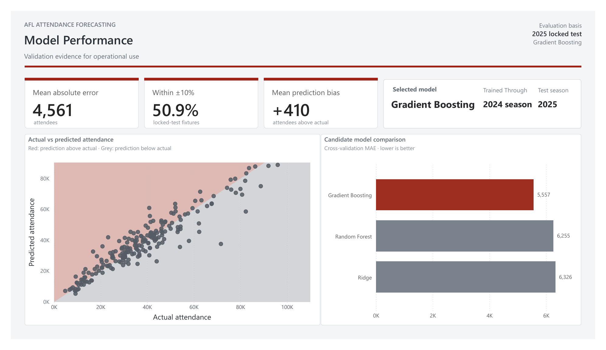
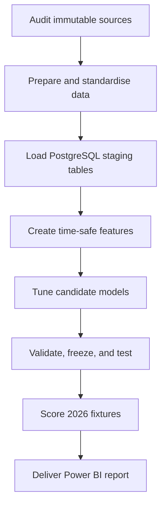

# AFL Matchday Demand Forecasting

An end-to-end data science portfolio project that turns public AFL match, fixture, venue, and calendar data into pre-match attendance forecasts and operational demand levels.

The project is framed as a matchday planning use case: forecast likely attendance for confirmed fixtures, identify relatively high-demand matches, and present the results in an operational Power BI report. The forecasts are decision-support estimates rather than ticket-sales figures, staffing rules, or exact attendance commitments.

## Dashboard

### Page 1 - Upcoming Match Demand


This page ranks the nine confirmed 2026 Round 24 fixtures available in the 17 August 2026 snapshot. It combines headline demand indicators, an interactive demand-level filter, a ranked attendance chart, and fixture-level planning detail.

### Page 2 - Model Performance



This page communicates the evidence behind the forecasts: locked-test error, prediction bias, actual-versus-predicted performance, the selected model, and the time-aware candidate-model comparison.

Report files:

- [Two-page dashboard export (PDF)](reports/dashboard/afl_matchday_demand_dashboard.pdf)
- [Interactive Power BI report (PBIX)](reports/powerbi/afl_matchday_demand_planning.pbix)
- [Page 1 preview (PNG)](reports/dashboard/afl_attendance_forecasting_dashboard.png)
- [Page 2 preview (PNG)](reports/dashboard/model_performance_dashboard.png)

## Project outcomes

| Area | Final result |
|---|---|
| Historical match source | 2,879 AFL matches covering 2012-2025 |
| Model-ready history | 2,297 eligible Australian matches across the training, validation, and locked-test periods |
| Model inputs | 17 pre-match features with time-shifted attendance and team-form history |
| Candidate models | Ridge Regression, Random Forest, and Gradient Boosting |
| Selected model | Gradient Boosting Regressor |
| 2024 validation | MAE 5,471; RMSE 7,719 |
| 2025 locked test | MAE 4,561; RMSE 6,560; mean prediction error +410 |
| Locked-test accuracy band | 50.9% of fixtures predicted within +/-10% of actual attendance |
| 2026 scoring snapshot | 9 confirmed Round 24 fixtures as at 17 August 2026 |
| Demand mix | 3 High, 5 Medium, and 1 Low fixture |

## Business question

> Using only information available before a match, what attendance should planners expect, and which confirmed fixtures deserve earlier operational review?

The current scoring snapshot was captured on 17 August 2026 for fixtures scheduled from 20 to 23 August. The resulting lead time is approximately three to six days, so this version is described as snapshot-based pre-match forecasting rather than a fixed seven-day forecast.

## End-to-end workflow



The workflow is implemented across seven executed notebooks:

| Notebook | Purpose | Main output |
|---|---|---|
| [01 - Raw data audit](notebooks/01_raw_data_audit.ipynb) | Verify source identity, schema, coverage, checksums, and known quality issues without changing the raw files | Audited source snapshots and documented correction rules |
| [02 - Data preparation and integration](notebooks/02_data_preparation_and_integration.ipynb) | Standardise teams, venues, dates, round labels, match identifiers, and school-calendar data | Five PostgreSQL-ready CSV tables |
| [03 - PostgreSQL data loading](notebooks/03_postgresql_data_loading.ipynb) | Create schemas and tables, load the prepared data in one transaction, and validate keys and relationships | Five validated `staging` tables |
| [04 - Feature engineering](notebooks/04_feature_engineering.ipynb) | Build leakage-safe historical features and align the historical and 2026 scoring schemas | 2,297 historical rows and 9 scoring rows with 17 ordered features |
| [05 - Candidate training and tuning](notebooks/05_candidate_model_training_and_tuning.ipynb) | Tune three regression families with six expanding-window cross-validation folds | One fitted candidate pipeline per model family |
| [06 - Final selection and evaluation](notebooks/06_final_model_selection_and_evaluation.ipynb) | Select on 2024 validation data, freeze the specification, and evaluate once on 2025 | Frozen Gradient Boosting specification and locked-test evidence |
| [07 - 2026 forecast and planning](notebooks/07_2026_attendance_forecast_and_matchday_planning.ipynb) | Refit the frozen pipeline through 2025, score confirmed fixtures, assign demand levels, and export BI inputs | Fixture forecasts, threshold reference, and Power BI data |

## Data preparation and database design

The version 1 workflow uses four public-data groups:

- AFLStats Version 6 match history, distributed through Kaggle, for scheduled match details, results, and recorded attendance;
- a fixed [Squiggle API](https://api.squiggle.com.au/) games and teams snapshot for 2026 results and fixtures;
- historical Australian capital-city school-holiday records; and
- reviewed official state and territory school calendars for 2024-2026.

Notebook 02 exports the following validated tables before they are loaded into PostgreSQL:

| PostgreSQL table | Rows | Grain |
|---|---:|---|
| `staging.historical_matches` | 2,879 | One completed historical match |
| `staging.squiggle_matches_2026_snapshot` | 218 | One Squiggle match record per snapshot |
| `staging.team_reference` | 18 | One standardised AFL team |
| `staging.venue_reference` | 27 | One standardised venue |
| `staging.school_holidays_daily` | 67,208 | One capital city and calendar date |

The preparation stage preserves source lineage while resolving known issues explicitly. This includes three reused 2024 provider game IDs, the 2024 Opening Round/Round 1 labelling anomaly, confirmed team and venue aliases, and one missing derived school-holiday category. A deterministic project `match_id` is created from match date and the canonical home and away team identifiers.

## Leakage-safe modelling design

### Time-based roles

| Dataset role | Seasons | Rows | Use |
|---|---|---:|---|
| Warm-up history | 2012 | 207 | Supplies earlier history; not fitted as target rows |
| Training | 2013-2019, 2022-2023 | 1,865 | Preprocessing, fitting, and time-aware tuning |
| Excluded | 2020-2021 and international matches | 375 | Excluded from attendance-target modelling |
| Validation | 2024 | 216 | Candidate comparison and final model selection |
| Locked test | 2025 | 216 | One-time out-of-time evaluation |

Random train-test splitting is not used. Hyperparameters are tuned through six expanding-window folds inside the training period, beginning with training on 2013-2015 and validation on 2016, then moving forward one available season at a time.

### Feature contract

The model uses 17 explicitly ordered pre-match features:

- scheduled context: season, reviewed round, home team, away team, venue, month, weekday, start hour, night-match status, and school-holiday status;
- attendance history: each team's previous-five-match mean attendance and the venue's previous-ten-match mean attendance; and
- recent team form: each team's previous-five-match win rate and mean score margin.

All historical attendance and result features are shifted before rolling calculations. Current-match attendance, scores, identifiers, completion fields, and other post-match information are excluded from the predictors.

Numerical imputation, categorical imputation, one-hot encoding, and model fitting are contained inside scikit-learn pipelines. Numerical features are standardised for Ridge Regression only. This keeps preprocessing inside each cross-validation fold and prevents validation information from leaking into training.

## Model selection and evaluation

Notebook 05 tunes the three candidate families using mean cross-validation MAE as the primary metric. Notebook 06 then compares the tuned candidates on the untouched 2024 validation season.

| Candidate | Mean time-aware CV MAE | 2024 validation MAE |
|---|---:|---:|
| Gradient Boosting | 5,557 | **5,471** |
| Random Forest | 6,255 | 6,462 |
| Ridge Regression | 6,326 | 6,751 |

Gradient Boosting was selected using the predefined lowest-validation-MAE rule. The frozen configuration was:

```text
learning_rate = 0.1
max_depth = 3
min_samples_leaf = 2
n_estimators = 500
```

After selection, the same specification was refitted on the training and 2024 validation data, then evaluated once on the locked 2025 season:

| Locked-test metric | Result |
|---|---:|
| MAE | 4,561 attendees |
| RMSE | 6,560 attendees |
| Mean prediction error | +410 attendees |
| Fixtures within +/-10% | 50.9% |

The positive mean prediction error indicates a small overall tendency to overpredict. Error dispersion is wider for some medium- and high-attendance matches, so the model is positioned as a demand-prioritisation tool rather than an exact attendance commitment.

After locked-test evaluation was complete, the unchanged pipeline was refitted on all 2,297 eligible matches through 2025 for forward scoring.

## 2026 forecast snapshot

The demand boundaries were fixed before the 2026 fixtures were scored. They are rounded historical tertiles from the 2,297 eligible matches:

| Demand level | Forecast rule | Historical matches |
|---|---:|---:|
| Low | Below 27,000 | 777 (33.8%) |
| Medium | 27,000 to below 40,000 | 756 (32.9%) |
| High | 40,000 or above | 764 (33.3%) |

These are relative portfolio signals, not official venue-capacity or staffing thresholds.

| Date | Fixture | Venue | Forecast | Level |
|---|---|---|---:|---|
| 21 Aug 2026 | Collingwood v Brisbane Lions | MCG | 77,848 | High |
| 22 Aug 2026 | Adelaide v Greater Western Sydney | Adelaide Oval | 46,296 | High |
| 23 Aug 2026 | West Coast v Hawthorn | Perth Stadium | 44,182 | High |
| 22 Aug 2026 | Melbourne v Western Bulldogs | MCG | 39,611 | Medium |
| 22 Aug 2026 | Geelong v Richmond | Kardinia Park | 36,723 | Medium |
| 22 Aug 2026 | Carlton v Fremantle | Docklands | 34,774 | Medium |
| 23 Aug 2026 | Sydney v North Melbourne | SCG | 34,153 | Medium |
| 23 Aug 2026 | Essendon v Port Adelaide | Docklands | 27,082 | Medium |
| 20 Aug 2026 | St Kilda v Gold Coast | Docklands | 21,675 | Low |

The average forecast across the nine fixtures is 40,260 attendees. Three fixtures are classified as High demand, while Sydney v North Melbourne is forecast at 34,153 and classified as Medium.

## Repository structure

```text
.
|-- notebooks/                 # Executed notebooks 01-07
|-- reports/
|   |-- dashboard/             # Two dashboard PNGs and the two-page PDF
|   |-- modeling/              # Versioned tuning and evaluation summaries
|   `-- powerbi/               # PBIX source and reporting input CSVs
|-- sql/                       # PostgreSQL schema and staging-table DDL
|-- src/                       # Database connection check
|-- .env.example               # Local PostgreSQL configuration template
`-- requirements.txt           # Reproducible Python environment
```

Raw data, processed data, local credentials, and fitted `.joblib` artifacts are intentionally excluded from version control. The executed notebooks preserve the transformation and validation evidence, while the compact modelling and Power BI reporting outputs are versioned under `reports/`.

## Local setup

```bash
git clone https://github.com/Aulymos/afl-matchday-demand-forecasting.git
cd afl-matchday-demand-forecasting
python -m venv AFL_venv
```

Activate the environment, then install the pinned dependencies:

```bash
pip install -r requirements.txt
```

Create a local `.env` file from `.env.example` and add the PostgreSQL connection details. After the database and project user exist, Notebook 03 runs the version-controlled SQL scripts in numerical order and loads the staging tables. The notebooks are designed to run sequentially from `01` through `07`.

The repository does not redistribute the raw source files. To reproduce the complete pipeline, obtain the named public datasets and fixed API snapshots, then place them in the project-relative locations documented in Notebooks 01 and 02.

## Technology

- Python, pandas, NumPy, and Matplotlib
- scikit-learn pipelines, time-aware cross-validation, and joblib
- PostgreSQL and psycopg
- Power BI, Power Query, and DAX
- Git and GitHub

## Limitations

- The model uses public data rather than internal ticketing, membership, marketing, or customer data.
- The current feature set excludes live ticket sales, player availability, forecast weather, transport disruption, and event-specific promotions.
- The 2026 forecast is based on a frozen 17 August snapshot and does not reflect later fixture or operational changes.
- Actual 2026 attendance was not available at scoring time, so the 2025 locked-test metrics provide historical context rather than a fixture-specific error bound.
- The model produces point forecasts rather than formal prediction intervals.
- Demand levels are relative historical attendance bands and should be combined with current operational information before decisions are finalised.

## Project status

Version 1 is complete through data audit, PostgreSQL loading, leakage-safe feature engineering, time-aware model selection, locked-test evaluation, 2026 fixture scoring, and two-page Power BI delivery.

This is an independent portfolio project and is not affiliated with, endorsed by, or based on internal data from the AFL or any AFL club.
