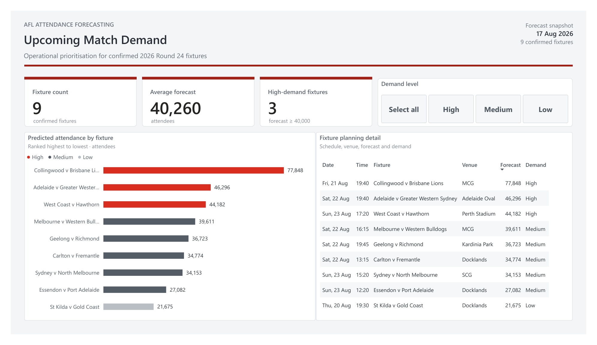

# AFL Attendance Forecasting

An end-to-end machine-learning portfolio project that forecasts attendance for confirmed AFL fixtures using information available before match day. The project is framed around a Sydney Swans business use case: helping membership, marketing and match-day operations teams identify fixtures that may require earlier review or additional resourcing.

## Dashboard preview

The Power BI dashboard converts model output into an operational view of upcoming demand. Users can:

- compare predicted attendance across confirmed fixtures;
- identify high-demand fixtures, defined in the current dashboard as a forecast of at least 40,000 attendees;
- filter the page by High, Medium and Low demand levels;
- inspect the corresponding date, start time, venue, forecast and demand classification; and
- use the forecast snapshot date to distinguish when the operational view was produced.

## Business objective

Forecast final realised attendance using only information available at least seven days before a fixture. The output is intended to support prioritisation and human review rather than replace operational judgement.

Attendance is treated as a public demand proxy. It should not be interpreted as ticket sales, membership revenue or total match-day revenue.

## Data and modelling approach

- Aggregated 206,722 player-match records into approximately 4,670 match-level observations.
- Combined historical AFL match data, Squiggle games and teams snapshots, and school-holiday information.
- Retained the disrupted 2020–2021 seasons in the raw data while excluding them from model fitting, validation and headline performance metrics.
- Engineered pre-match features with shifted rolling calculations to prevent future information from leaking into a forecast.
- Compared a home-team-by-venue rolling-median baseline with Ridge, Random Forest and Gradient Boosting models.
- Used forward-chaining validation, a 2022 validation season and a locked 2023 test season.
- Evaluated performance using MAE, RMSE, WAPE, accuracy within ±10%, and subgroup error analysis.

## Delivery architecture

The delivery workflow is designed as a weekly AWS batch-scoring process using:

- Amazon EventBridge for scheduling;
- AWS Lambda for orchestration;
- Amazon S3 for versioned inputs and outputs;
- Amazon Athena for query access;
- Amazon SageMaker Batch Transform for scoring; and
- Amazon CloudWatch for monitoring.

Model outputs are surfaced in Power BI with demand tiers and fixture-level operational detail.

## Dashboard files

- [Dashboard preview (PNG)](reports/dashboard/afl_attendance_forecasting_dashboard.png)
- [Dashboard export (PDF)](reports/dashboard/afl_attendance_forecasting_dashboard.pdf)
- [Power BI source file](reports/powerbi/afl_matchday_demand_planning.pbix)

The PNG provides a quick repository preview, the PDF provides a high-resolution static export, and the PBIX file contains the interactive report.

## Technology

- Python for data preparation, feature engineering, modelling and evaluation
- Power BI and DAX for operational reporting
- AWS for scheduled batch scoring, storage, query access and monitoring
- Git and GitHub for version control and reproducibility
